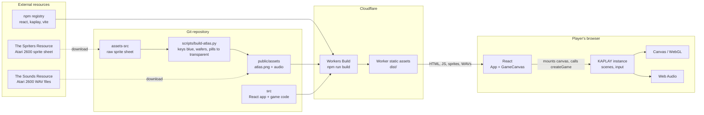
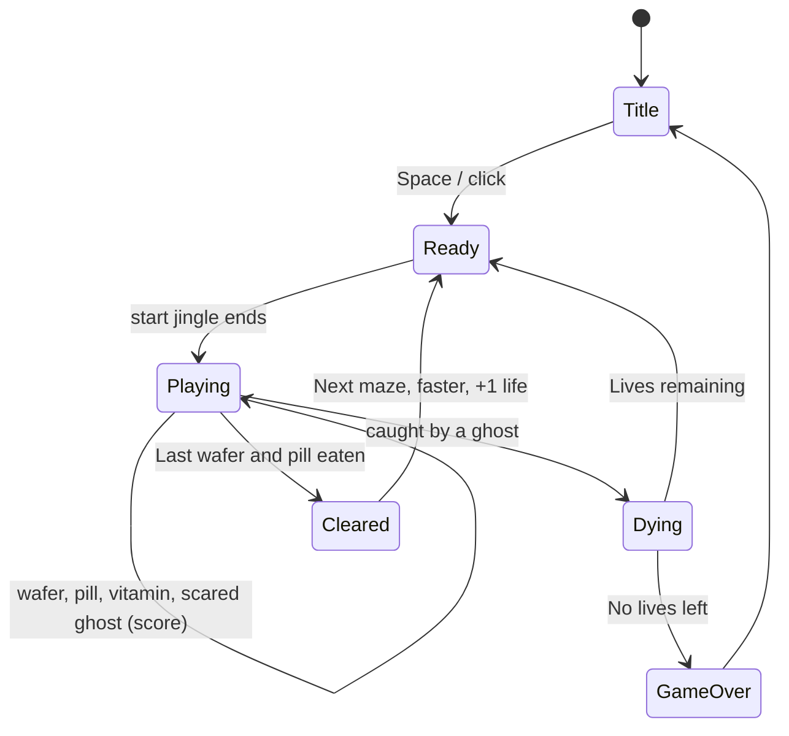

# Pac-Man (Atari 2600) in React

A recreation of the 1982 Atari 2600 *Pac-Man*, built with **React + KAPLAY** and hosted on **Cloudflare Workers**.

> Pac-Man is a Bandai Namco property and the Atari 2600 port was published by Atari. This project is for educational/fun purposes only. See [Asset licensing](#asset-licensing-and-credits) before forking.

## Stack

| Concern | Choice | Notes |
| --- | --- | --- |
| UI shell | React 19 + TypeScript | Owns the page, canvas element, and footer |
| Game engine | [KAPLAY](https://kaplayjs.com/) 3001 | Scenes, sprites, input, audio. Runs with `global: false` |
| Bundler | Vite 8 | `npm run dev` / `npm run build` |
| Hosting | Cloudflare Workers (static assets) | Static site: build output is `dist/` |
| Resolution | 320 × 200 logical | The 2600's 160-pixel playfield doubled horizontally (as in the sprite rip), letterboxed and scaled with pixelated rendering |
| Font | Press Start 2P (`@fontsource`) | Self-hosted, loaded at 8px so text stays crisp |

## Resources

| Asset | Source | Where it lives |
| --- | --- | --- |
| Atari 2600 sprites ("General", 320×350 PNG: maze, Pac-Man, ghosts, vitamin, digits), ripped by **KingPepe** | [The Spriters Resource, asset 33529](https://www.spriters-resource.com/atari_2600/pacman/asset/33529/) | `assets-src/general.png`, built into `public/assets/sprites/atlas.png` |
| Sound effects (begin, pellet, power pellet, blue ghost, ghost eaten, die), ripped by **alexparr** | [The Sounds Resource, asset 431332](https://sounds.spriters-resource.com/atari_2600/pacman/asset/431332/) | `public/assets/audio/pm-a2600_*.wav` |
| Game engine | [KAPLAY docs](https://kaplayjs.com/docs/) | npm dependency |

Sprite sheets are downloaded from `https://www.spriters-resource.com/media/assets/<id-prefix>/<id>.png` (the page's "Download Asset" link) and sounds from `https://sounds.spriters-resource.com/media/assets/<id-prefix>/<id>.zip`; the sites reject script requests without a browser User-Agent and Referer.

## Architecture

How the external services, the repo, and the runtime relate:



Runtime ownership: React owns the `<canvas>` element and its lifecycle (mount creates the KAPLAY instance, unmount calls `k.quit()`). KAPLAY owns everything drawn on the canvas. They talk only through `createGame(canvas)`.

### Game flow



## Project structure

```
.
├── index.html
├── wrangler.toml            # Cloudflare Worker (static assets) config for `npm run deploy`
├── assets-src/              # raw sprite sheet (not shipped)
├── scripts/build-atlas.py   # raw sheet -> transparent atlas, wafers and pills removed from the maze
├── tests/game.test.ts       # vitest: maze geometry, reachability, tunnel, pen, movement, ghost AI, scoring
├── public/assets/
│   ├── audio/               # pm-a2600_{begin,pellet,powerpellet,blueghost,ghosteaten,die}.wav
│   └── sprites/atlas.png    # generated, blue keyed to transparent
└── src/
    ├── main.tsx             # React entry
    ├── App.tsx              # page layout + credits footer
    ├── index.css
    └── game/
        ├── GameCanvas.tsx   # React <-> KAPLAY bridge (mount / cleanup)
        ├── createGame.ts    # kaplay() init, asset load, scene registration
        ├── constants.ts     # resolution, speeds, timings, points, palette
        ├── sprites.ts       # frame table indexing atlas.png
        ├── assets.ts        # font, sprite atlas and sound loading
        ├── maze.ts          # maze map (traced from the art), lane graph, movement along it, dots
        ├── pacman.ts        # Pac-Man steering: buffered turns, instant reverse (pure logic)
        ├── ghost.ts         # ghost pen, release, chase / wander / flee AI (pure logic)
        ├── rules.ts         # eating, collisions, ghost points, level difficulty (pure logic)
        ├── hud.ts           # green score bar and reserve lives
        ├── state.ts         # score, high score, lives, level
        └── scenes/          # title.ts, level.ts (draws the logic, plays sounds, runs ready/death/clear flow)
```

Changing `assets-src/general.png` requires regeneration of the atlas with `pip install pillow && python3 scripts/build-atlas.py`.

## Getting started

```bash
nvm use          # Node 26 (see .nvmrc)
npm install
npm run dev      # http://localhost:5173
```

Other scripts: `npm test` (game-logic tests), `npm run build`, `npm run preview`, `npm run typecheck`.

**Controls:** arrows or WASD to steer. Pac-Man keeps moving until he hits a wall; press a turn before the corner and he takes it when he gets there.

## Deploying to Cloudflare

This ships as a Worker with static assets: `npm run deploy` builds and runs `wrangler deploy` (Worker name `pacman`).

## Asset licensing and credits

- **KingPepe's** sprite rip states "Credit is not needed but would be nice". Credit is shown in the page footer and on the title screen.
- **alexparr's** sound rip carries no stated license; it is credited in the same places.
- Pac-Man itself belongs to Bandai Namco, and neither source page grants rights to it.

Before making the deployed site public, decide whether to keep the site private or unlisted, swap in original art and audio, or get permission from the rights holders.

## Design notes

- **The maze is data.** `MAP` in `src/game/maze.ts` was generated from the sprite sheet: 40 columns of 8px, alternating 4px wall rows and 16px lanes. It reproduces the 2600's 126 video wafers and 4 power pills, and a test checks every one is reachable.
- **2600 quirks kept:** the escape tunnel wraps top-to-bottom (not sideways), Pac-Man only ever faces left or right, wafers are dashes, pills blink, a vitamin replaces the arcade fruit, and clearing a maze awards an extra life.
- **2600 quirk left out:** the original's ghost flicker (each ghost drawn every fourth frame). It's hard on the eyes and on photosensitive players.
- **Tunable numbers** live in `src/game/constants.ts`: speeds, ghost release times and chase chance, fright time, vitamin timing. Point values follow the 2600 manual (wafer 1, pill 5, vitamin 100, ghosts 20/40/80/160); speeds and AI aren't documented, so those are playable guesses, not measurements.
